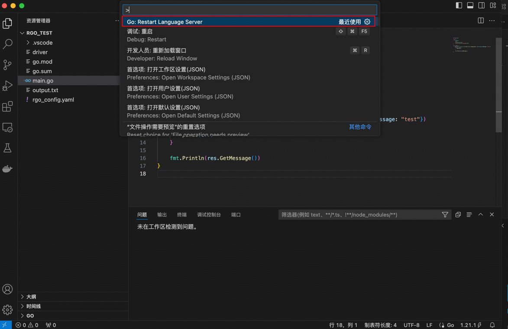

# RGO
RGO 目前处于 MVP 阶段

# 运行步骤

目前 RGO 需要运行的组件有 VS-Code 插件和 gopackagesdriver 两个组件。

VS-Code 插件因为还未发布，所以目前只能在 VS-Code 本地调试运行。

## clone RGO 仓库

```shell
git clone git@github.com:cloudwego-contrib/rgo.git
```

## 编译生成 gopackagesdriver

```shell
cd driver
go build -o driver .
```

## 编译生成 VS-Code 插件 go-lsp 可执行文件

```shell
cd ~/rgo
go build -o main .
```

## 将go-lsp 可执行文件移动到 VS-Code 插件目录

```shell
mv main ./lsp/server/bin/
```

## 在 VS-Code 中调试运行插件
运行 lsp/client/src/extensions.ts


## 新建项目
    
```shell
mkdir -p ~/rgo_test
cd ~/rgo_test
go mod init rgo_test
```

将 driver 文件移至根目录
```shell
mv ~/rgo/driver ~/rgo_test/
```

## 在根目录下新建配置文件 rgo_config.yaml

```yaml
idl_repos:
    - repo_name: repo_name1
      repo_git: git@github.com:ViolaPioggia/IDL_REPO.git
      branch: main
      commit: # commit id 非必填
idls:
    - idl_path: ./echo.thrift
      idl_repo: repo_name1
      service_address: service-one.example.com
      service_name: service_one
    - idl_path: ./hello.thrift
      idl_repo: repo_name1
      service_address: service-two.example.com
      service_name: service_two

```

## 修改 VS-Code 配置

```shell
vim .vscode/settings.json
```

填入配置并保存

```json
{
  "go.toolsEnvVars": {
    "GOPACKAGESDRIVER":"${workspaceFolder}/driver"
  },
  "go.enableCodeLens": {
    "runtest": false
  },
  "gopls": {
    "formatting.gofumpt": true,
    "formatting.local": "rgo/",
    "ui.completion.usePlaceholders": false,
    "ui.semanticTokens": true,
    "ui.codelenses": {
      "gc_details": false,
      "regenerate_cgo": false,
      "generate": false,
      "test": false,
      "tidy": false,
      "upgrade_dependency": false,
      "vendor": false
    }
  },
  "go.useLanguageServer": true,
  "go.buildOnSave": "off",
  "go.lintOnSave": "off",
  "go.vetOnSave": "off"
}

```

## 效果展示


# Tips:

1. 因为官方 golsp 存在解析缓存问题，所以在 RGO 代码变更后目前无法第一时间获取变更依赖。

暂时的解决方案是用户自行通过 command + shift + p 重启 golsp 刷新依赖或者 command + 鼠标左键进入 RGO 的代码强制刷新。

