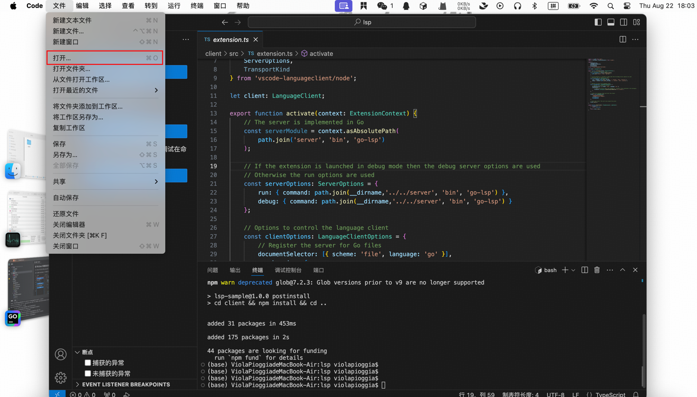
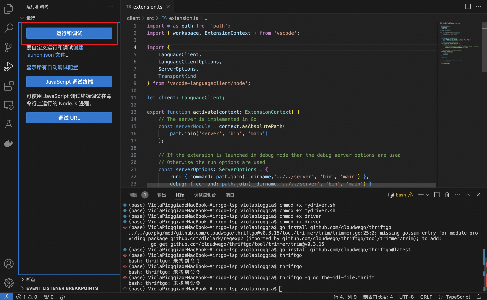
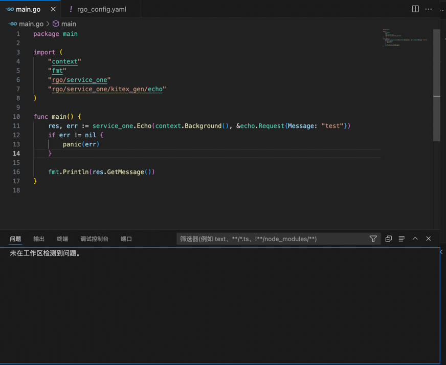
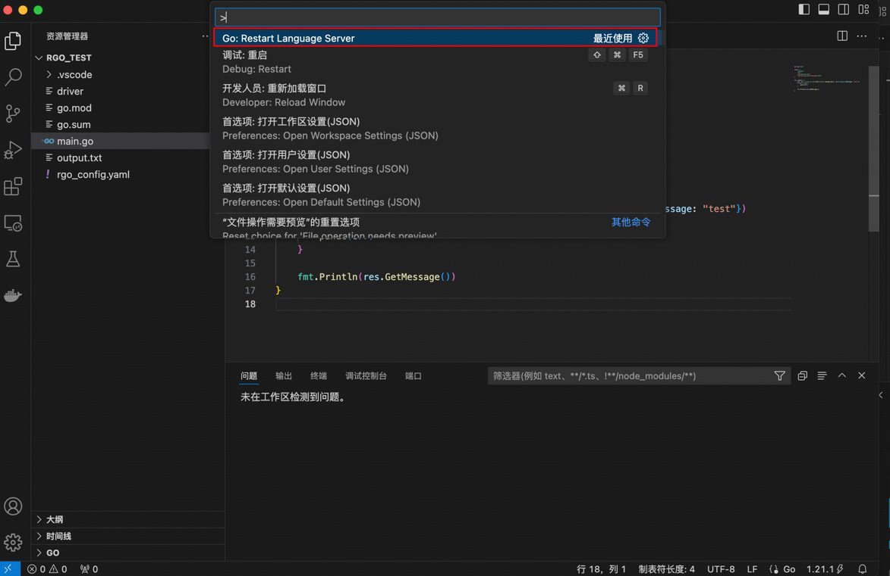

# RGO
RGO 目前处于 MVP 阶段

# 运行步骤

目前 RGO 需要运行的组件有 VS-Code 插件和 gopackagesdriver 两个组件。

VS-Code 插件因为还未发布，所以目前只能在 VS-Code 本地调试运行。

## clone RGO 仓库

```shell
git clone https://github.com/cloudwego-contrib/rgo.git

cd rgo

git checkout feat/new_rgo
```

## 编译生成 gopackagesdriver

```shell
cd driver

go mod tidy

go build -o rgo_packages_driver .
```

## 在 VS-Code 中调试运行插件
在 VS-Code 中打开克隆下来的 rgo/lsp 项目




执行以下命令安装依赖
```shell
npm install
```

点开 ./client/src/extensions.ts 并在侧边栏中点击 Run Extension



## 新建测试项目

然后会弹出搭载了 go-lsp 插件的 vscode 窗口，新建一个新的项目用于展示效果

```shell
mkdir -p ~/rgo_test
cd ~/rgo_test
go mod init rgo_test
```

将刚刚编译的 driver 文件移至根目录
```shell
mv ~/rgo/rgo_packages_driver ~/rgo_test/
```

## 在根目录下新建配置文件 rgo_config.yaml

```yaml
idl_repos:
    - repo_name: repo_name1
      repo_git: git@github.com:ViolaPioggia/IDL_REPO.git
      branch: main
      commit: # commit 非必填
idls:
    - idl_path: ./echo.thrift
      idl_repo: repo_name1
      service_name: service_one
    - idl_path: ./hello.thrift
      idl_repo: repo_name1
      service_name: service_two

```

## 修改 VS-Code 配置

```shell
vim .vscode/settings.json
```

填入配置并保存

```json
{
  "go.toolsEnvVars": {
    "GOPACKAGESDRIVER":"${workspaceFolder}/rgo_packages_driver"
  },
  "go.enableCodeLens": {
    "runtest": false
  },
  "gopls": {
    "formatting.gofumpt": true,
    "formatting.local": "rgo/",
    "ui.completion.usePlaceholders": false,
    "ui.semanticTokens": true,
    "ui.codelenses": {
      "gc_details": false,
      "regenerate_cgo": false,
      "generate": false,
      "test": false,
      "tidy": false,
      "upgrade_dependency": false,
      "vendor": false
    }
  },
  "go.useLanguageServer": true,
  "go.buildOnSave": "off",
  "go.lintOnSave": "off",
  "go.vetOnSave": "off"
}

```

## 效果展示


# Tips:

1. 因为官方 gopls 存在解析缓存问题，所以在 RGO 代码变更后目前无法第一时间获取变更依赖。

暂时的解决方案是用户自行通过 command + shift + p 重启 gopls 刷新依赖或者 command + 鼠标左键进入 RGO 的代码强制刷新。

