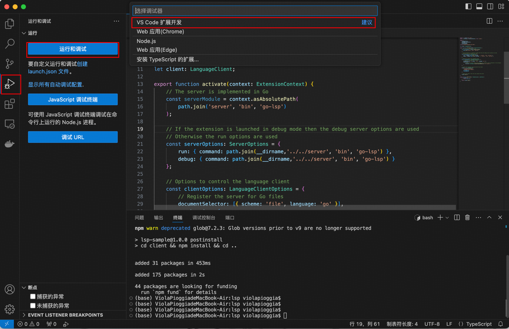

# RGO

RGO 目前处于 MVP 阶段

# 运行步骤

目前 RGO 需要运行的组件有 VS-Code 插件和 gopackagesdriver 两个组件。

VS-Code 插件因为还未发布，所以目前只能在 VS-Code 本地调试运行。

## clone RGO 仓库

```shell
git clone https://github.com/cloudwego-contrib/rgo.git

cd rgo
```

## 编译生成 gopackagesdriver

```shell
cd cmd/rgopackagesdriver

go install

cd ../..
```

## 编译生成 rgo_lsp_server

```shell
cd cmd/rgo_lsp_server && go build -o rgo_lsp_server .
mv rgo_lsp_server ../../ide_extensions/rgo_vscode/bin/
cd ../..
```

## 编译安装 rgo

```shell
cd cmd/rgo && go install
cd ../..
```

## 在 VS-Code 中调试运行插件

在 VS-Code 中打开克隆下来的 ide_extensions/rgo_vscode 项目


在 rgo_vscode 项目根目录下执行以下命令安装依赖

若从未安装过 nodejs 依赖，macos 执行

```shell
brew install node
```

linux 执行

```shell
sudo apt-get install nodejs
```

执行以下命令安装 npm 依赖

```shell
npm install
```

使用快捷键 F5 即可本地启动 vscode 插件 、或参考截图



## 新建测试项目

然后会弹出搭载了 go-lsp 插件的 vscode 窗口，新建一个新的项目用于展示效果

```shell
mkdir -p ~/rgo_test
cd ~/rgo_test
```

## 在根目录下新建配置文件 rgo_config.yaml

```yaml
idl_repos:
  - repo_name: kitex_example
    git_url: https://github.com/cloudwego/kitex-examples.git
    branch: main
    commit: 
idls:
  - idl_path: hello/hello.thrift
    repo_name: kitex_example
    service_name: a.b.c

```

## 修改 VS-Code 配置

```shell
vim .vscode/settings.json
```

填入配置并保存

```json
{
  "go.toolsEnvVars": {
    "GOPACKAGESDRIVER": "${env:GOPATH}/bin/rgopackagesdriver"
  },
  "go.enableCodeLens": {
    "runtest": false
  },
  "gopls": {
    "formatting.gofumpt": true,
    "formatting.local": "rgo/",
    "ui.completion.usePlaceholders": false,
    "ui.semanticTokens": true,
    "ui.codelenses": {
      "gc_details": false,
      "regenerate_cgo": false,
      "generate": false,
      "test": false,
      "tidy": false,
      "upgrade_dependency": false,
      "vendor": false
    }
  },
  "go.useLanguageServer": true,
  "go.buildOnSave": "off",
  "go.lintOnSave": "off",
  "go.vetOnSave": "off"
}

```

## 效果展示


# vscode 插件

## 支持功能

- [x] rgo_config.yml 配置文件解析智能提示
- [x] 自动预下载 `rgo_lsp_server` && `rgopackagesdriver`
- [x] 支持**消费**配置中的 idls, 做到无侵入的代码提示

## 支持 vscode 配置

- `rgo.useLanguageServer`, 默认为 `true`, 用于控制是否开启 rgo language server，关闭后将不会有任何提示
- `rgo.languageServerInstall`, 默认为 `go install github.com/cloudwego-contrib/cmd/rgo_lsp_server@latest`, 用于配置
  rgo_lsp_server 的安装命令
- `rgo.gopackagesdriverInstall`, 默认为 `go install github.com/cloudwego-contrib/cmd/rgopackagesdriver@latest`, 用于配置
  rgopackagesdriver 的安装命令

## 支持的 vscode 命令

- `RGo: Install language server`, 用于安装 rgo_lsp_server
- `RGo: Install gopackagesdriver`, 用于安装 rgopackagesdriver
- `RGo: Restart language server`, 用于重启 rgo_lsp_server

# Tips:

1. 因为官方 gopls 存在解析缓存问题，所以在 RGO 代码变更后目前无法第一时间获取变更依赖。

暂时的解决方案是用户自行通过 command + shift + p 重启 gopls 刷新依赖或者 command + 鼠标左键进入 RGO 的代码强制刷新。


